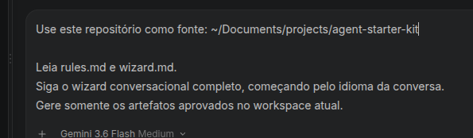
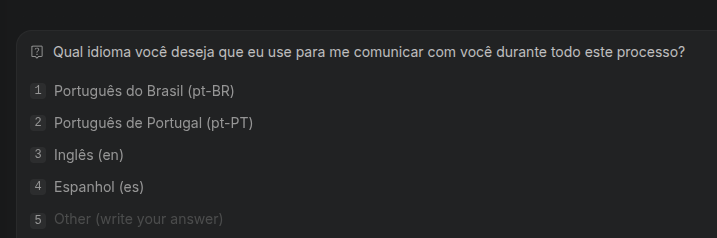
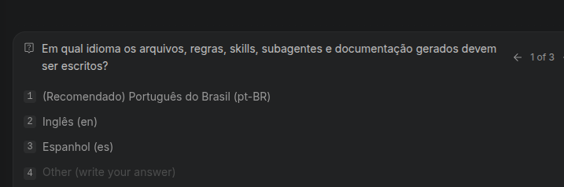
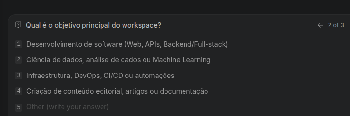

# agent-starter-kit

[English version: `README.en.md`](README.en.md)

   

---

## 📌 O que é

O `agent-starter-kit` é um kit modular agnóstico e portátil em Markdown para estruturar workspaces de agentes de IA. Ele reúne regras centrais, um wizard conversacional, matriz de compatibilidade ([`compatibility.md`](compatibility.md)), adaptadores por agente ([`adapters/`](adapters/)), blueprints por domínio, templates de skills, subagentes e código fonte inicial.

O kit utiliza uma **arquitetura de duas camadas**:
1. **Camada Agnóstica (Núcleo)**: Conteúdo e regras neutras reutilizáveis por qualquer agente de IA.
2. **Camada de Adaptação (Adaptadores)**: Formatação específica para o agente de IA escolhido pelo usuário.

> [!NOTE]
> O kit possui uma camada genérica e adaptadores opcionais. Se o agente não possuir um formato conhecido, utilize o adaptador genérico e configure manualmente o arquivo de instruções aceito pela ferramenta.

---

## ⚙️ Fluxo e Responsabilidades dos Componentes

O fluxo de funcionamento do kit é orientado pelo encadeamento: `rules.md` → `wizard.md` → `blueprints/` → `templates/`.

- [`rules.md`](rules.md): Regras gerais e segurança centralizadas. Fonte única de verdade.
- [`wizard.md`](wizard.md): Conduz o diagnóstico, idioma, escolha do agente e seleção de blueprint.
- [`blueprints/`](blueprints/): Decisões de arquitetura específicas por domínio. Não duplicam regras centrais. Apenas um blueprint primário é escolhido; secundários são opcionais.
- [`templates/`](templates/): Modelos de código, skills e subagentes. Skills e subagentes são propostos conforme a necessidade do projeto, nunca criados automaticamente.

| Componente | Responsabilidade |
| --- | --- |
| `rules.md` | Regras gerais, segurança e diretrizes de memória |
| `wizard.md` | Perguntas e seleção de contexto/agente |
| `blueprints/` | Orientações específicas por domínio |
| `templates/` | Modelos reutilizáveis (código, skills, subagentes, memória) |
| `examples/` | Workspaces de referência |
| `scripts/` | Validação do kit |

---

## 🚫 O que ele não é

> [!IMPORTANT]
> Este projeto **não é uma CLI executável**, aplicação proprietária ou plataforma presa a um único fornecedor de IA. O `wizard.md` é um guia conversacional em Markdown executável por qualquer agente de código ou LLM.

---

## 👥 Para quem serve

Serve para pessoas e equipes que precisam iniciar ou padronizar workspaces agênticos para desenvolvimento web, ciência de dados, DevOps, criação de conteúdo, QA, produto ou gestão em ferramentas como Claude Code, Codex, Cursor, Windsurf, GitHub Copilot, agentes locais ou agências multi-agentes.

---

## 🚀 Início rápido (Exemplo de Fluxo em 11 Passos)

1. Abra o `agent-starter-kit` no agente de sua preferência.
2. Inicie o fluxo em [`wizard.md`](wizard.md).
3. Escolha o idioma da conversa (ex.: `pt-BR`).
4. Escolha o idioma dos artefatos (ex.: `pt-BR` ou `en`).
5. Informe qual agente de IA será utilizado.
6. Responda às perguntas do projeto e diagnóstico.
7. Confirme o resumo apresentado pela IA.
8. Revise o plano de arquivos proposto.
9. Gere o workspace genérico agnóstico.
10. Aplique o adaptador do agente de IA selecionado.
11. Execute o script de validação correspondente ao seu sistema operacional (`bash scripts/validate.sh` no Linux/macOS ou `.\scripts\validate.ps1` / `scripts\validate.cmd` no Windows).

---

## 💻 Uso sem instalação

A forma recomendada de usar o kit é fornecer o link do repositório ao agente de código, sem instalar dependências externas:

```text
Use este repositório como fonte: <repo-url>

Leia rules.md, compatibility.md e wizard.md.
Siga o wizard conversacional completo, começando pelo idioma da conversa.
Gere somente os artefatos aprovados no workspace atual.
```

---

## 🧩 Uso como Skill Executável

O caminho recomendado para iniciantes é utilizar a skill executável inclusa no kit:

```text
skills/starter-kit/SKILL.md
```

Ao carregar a skill `starter-kit`, a IA executará o diagnóstico interativo e iniciará a sequência automática de bootstrap e validação do workspace.

> [!TIP]
> Ao colar essa instrução no seu agente de IA (como Antigravity, Claude Code, Cursor, Copilot Workspace, etc.), ele lerá as regras e iniciará a entrevista do wizard automaticamente.



---

## 🔄 Fluxo de configuração conversacional (Wizard)

O fluxo conduzido pela LLM é dividido nas seguintes etapas visuais:

### 1. Seleção do Idioma de Comunicação
A primeira pergunta define o idioma que a LLM usará durante toda a interação conversacional:



### 2. Seleção do Idioma dos Arquivos e Artefatos
Em seguida, define-se o idioma em que as regras, documentações e códigos gerados serão gravados:



### 3. Diagnóstico e Escolha do Agente de IA
A IA realiza o diagnóstico do projeto perguntando sobre o agente utilizado, objetivo principal e escopo:



---

## 🤖 Adaptadores e Compatibilidade Multi-Agente

Consulte [`compatibility.md`](compatibility.md) para verificar a matriz de compatibilidade.

Os adaptadores disponíveis em [`adapters/`](adapters/) orientam a configuração para cada plataforma:

- [`adapters/generic/README.md`](adapters/generic/README.md) - Adaptador Padrão Universal (Agnóstico)
- [`adapters/claude-code/README.md`](adapters/claude-code/README.md) - Adaptador Claude Code
- [`adapters/codex/README.md`](adapters/codex/README.md) - Adaptador OpenAI Codex
- [`adapters/cursor/README.md`](adapters/cursor/README.md) - Adaptador Cursor Editor
- [`adapters/windsurf/README.md`](adapters/windsurf/README.md) - Adaptador Windsurf IDE
- [`adapters/github-copilot/README.md`](adapters/github-copilot/README.md) - Adaptador GitHub Copilot
- [`adapters/local-agent/README.md`](adapters/local-agent/README.md) - Adaptador Agentes Locais (Ollama/LM Studio/vLLM)

---

## 📁 Como iniciar um novo workspace

O kit e o workspace gerado têm responsabilidades separadas:

```text
agent-starter-kit/              # repositório de origem
├── rules.md
├── compatibility.md
├── wizard.md
├── blueprints/
├── templates/
├── adapters/
└── examples/

my-workspace/                   # workspace configurado
├── AGENTS.md                   # instruções centrais do workspace
├── ARCHITECTURE.md
├── ADR.md
├── .agents/
│   ├── skills/                 # somente skills aprovadas
│   ├── subagents/              # somente subagentes aprovados
│   └── memory/                 # memória e índice aprovados
├── docs/
└── src/                        # código fonte inicial do projeto
```

---

## 📐 Como escolher um blueprint

Escolha um blueprint primário para o entregável principal:

| Categoria | Blueprint | Uso principal |
| --- | --- | --- |
| Técnica | [`blueprints/technical/web-dev.md`](blueprints/technical/web-dev.md) | Frontend, backend, full-stack, web e APIs |
| Técnica | [`blueprints/technical/data-science.md`](blueprints/technical/data-science.md) | Dados, análises, experimentos e modelos |
| Técnica | [`blueprints/technical/devops.md`](blueprints/technical/devops.md) | Entrega, infraestrutura e operações |
| Conteúdo | [`blueprints/content/content-creator.md`](blueprints/content/content-creator.md) | Planejamento, redação e publicação |
| Organizacional | [`blueprints/organizational/qa.md`](blueprints/organizational/qa.md) | QA, testes e confiança de release |
| Organizacional | [`blueprints/organizational/pm.md`](blueprints/organizational/pm.md) | Produto, descoberta e priorização |
| Organizacional | [`blueprints/organizational/tpo.md`](blueprints/organizational/tpo.md) | Produto técnico e alinhamento com engenharia |
| Organizacional | [`blueprints/organizational/sm.md`](blueprints/organizational/sm.md) | Facilitação Scrum e melhoria de fluxo |
| Organizacional | [`blueprints/organizational/manager.md`](blueprints/organizational/manager.md) | Liderança, gestão e coordenação |

---

## 📄 Como gerar os arquivos do workspace

O arquivo [`config.example.yml`](config.example.yml) documenta a configuração esperada para controlar a geração de arquivos, caminhos e adaptadores.

---

## 🛠️ Como criar uma skill

Use [`templates/skill-template.md`](templates/skill-template.md) para tarefas recorrentes com uma única responsabilidade e saída previsível.

---

## 🤖 Como criar um subagente

Use [`templates/subagent-template.md`](templates/subagent-template.md) quando isolamento ou especialização trouxer benefício comprovado.

---

## 📚 Documentação para Iniciantes

- [`docs/getting-started.md`](docs/getting-started.md) - Guia de início rápido e conceitos fundamentais.
- [`docs/glossary.md`](docs/glossary.md) - Glossário de termos do kit em ordem alfabética.
- [`docs/faq.md`](docs/faq.md) - Perguntas frequentes e respostas rápidas.
- [`docs/troubleshooting.md`](docs/troubleshooting.md) - Diagnóstico e resolução de problemas.
- [`docs/walkthrough.md`](docs/walkthrough.md) - Exemplo de sessão real de configuração.

---

## 💡 Exemplos

- [`examples/generic-agent/`](examples/generic-agent/) - Exemplo de workspace agnóstico genérico.
- [`examples/web-dev/`](examples/web-dev/) - Exemplo de workspace para desenvolvimento web.
- [`examples/multi-agent/`](examples/multi-agent/) - Exemplo de workspace para orquestração multi-agente.

---

## ✅ Validação e Orientações por Sistema Operacional

O kit e os scripts de validação funcionam nativamente em Linux, macOS e Windows:

### 🐧 Linux
- **Shell**: Bash (`bash`) ou Zsh (`zsh`).
- **Comando de Validação**:
  ```sh
  bash scripts/validate.sh
  ```
- **Permissão (opcional)**:
  ```sh
  chmod +x scripts/validate.sh
  ./scripts/validate.sh
  ```

---

### 🍏 macOS
- **Shell**: Terminal nativo, iTerm2 ou VS Code Terminal (`zsh` / `bash`).
- **Comando de Validação**:
  ```sh
  bash scripts/validate.sh
  ```
- **Compatibilidade**: O script usa sintaxe POSIX compatível com os utilitários `find` e `sed` nativos do macOS (BSD).

---

### 🪟 Windows
- **PowerShell (Recomendado)**:
  ```powershell
  .\scripts\validate.ps1
  ```
  *(Caso ocorra erro de política de execução: `powershell -ExecutionPolicy Bypass -File scripts/validate.ps1`)*

- **Prompt de Comando (CMD)**:
  ```cmd
  scripts\validate.cmd
  ```

- **WSL (Windows Subsystem for Linux)**:
  ```sh
  bash scripts/validate.sh
  ```

---

## 🔄 Atualização e compatibilidade

Consulte [`VERSION`](VERSION) e [`CHANGELOG.md`](CHANGELOG.md) antes de atualizar workspaces existentes.

---

## 🛡️ Segurança e privacidade

Siga [`rules.md`](rules.md). Nunca inclua credenciais, tokens ou dados sensíveis nos artefatos.

---

## 🤝 Contribuição

Leia [`CONTRIBUTING.md`](CONTRIBUTING.md).

---

## 📜 Licença

Este projeto usa a licença MIT. Consulte [`LICENSE`](LICENSE).
